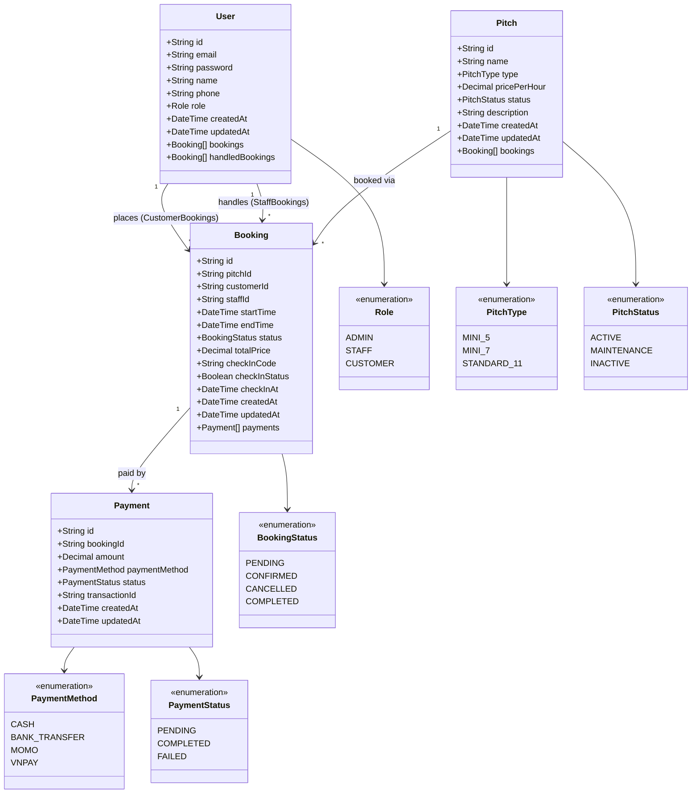
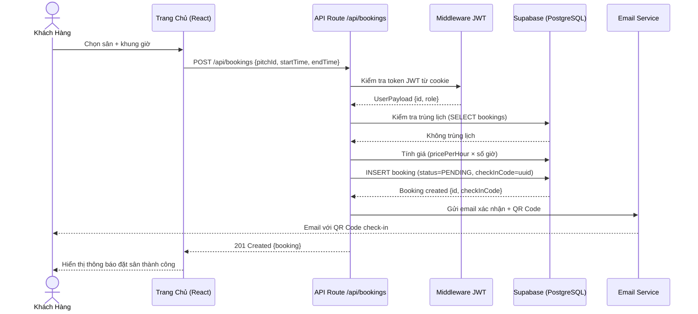
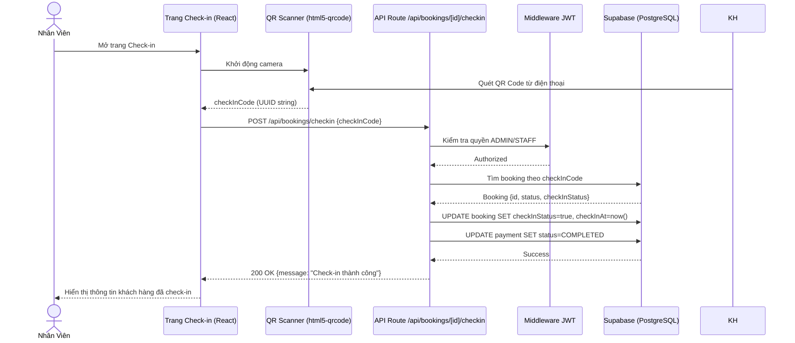

# UML Diagrams — Hệ thống Quản lý Sân Bóng

Tài liệu này chứa các biểu đồ UML mô tả thiết kế hệ thống Quản lý Sân Bóng Mini.

---

## 1. Use Case Diagram

```mermaid
graph TB
    subgraph Actors["Tác nhân"]
        KH[👤 Khách Hàng]
        NV[👔 Nhân Viên / Staff]
        QT[👑 Quản Trị / Admin]
    end

    subgraph UC_KH["Use Cases — Khách Hàng"]
        UC1([Đăng ký tài khoản])
        UC2([Đăng nhập])
        UC3([Xem danh sách sân bóng])
        UC4([Đặt sân trực tuyến])
        UC5([Xem lịch đặt của mình])
        UC6([Xem QR Code check-in])
        UC7([Nhận email xác nhận])
        UC8([Đăng xuất])
    end

    subgraph UC_NV["Use Cases — Nhân Viên"]
        UC9([Xem danh sách booking])
        UC10([Duyệt / Hủy booking])
        UC11([Check-in bằng QR Code])
        UC12([Xem dashboard thống kê])
        UC13([Quản lý thanh toán])
    end

    subgraph UC_QT["Use Cases — Quản Trị"]
        UC14([Quản lý sân bóng CRUD])
        UC15([Quản lý tài khoản người dùng])
        UC16([Xem báo cáo doanh thu])
        UC17([Xuất báo cáo Excel])
        UC18([Tất cả UC của Nhân Viên])
    end

    KH --> UC1
    KH --> UC2
    KH --> UC3
    KH --> UC4
    KH --> UC5
    KH --> UC6
    KH --> UC7
    KH --> UC8

    NV --> UC2
    NV --> UC9
    NV --> UC10
    NV --> UC11
    NV --> UC12
    NV --> UC13
    NV --> UC8

    QT --> UC14
    QT --> UC15
    QT --> UC16
    QT --> UC17
    QT --> UC18
    UC18 -.->|include| UC9
    UC18 -.->|include| UC10
    UC18 -.->|include| UC11

    UC4 -.->|include| UC7
```



---

## 2. Class Diagram



---

## 3. Sequence Diagram — Luồng Đặt Sân



---

## 4. Sequence Diagram — Luồng Check-in QR Code



---

## 5. Component Architecture Diagram

```mermaid
graph TB
    subgraph Frontend["Frontend — Next.js App Router"]
        LP[Landing Page /]
        Login[/login]
        Register[/register]
        subgraph Admin["Admin Panel /admin"]
            Dashboard[Dashboard]
            Pitches[Quản lý Sân /admin/pitches]
            Bookings[Quản lý Đặt Sân /admin/bookings]
            Customers[Quản lý KH /admin/customers]
            CheckIn[Check-in /admin/checkin]
        end
        subgraph Customer["Customer Portal /customer"]
            MyBookings[Lịch đặt /customer/bookings]
        end
    end

    subgraph Middleware["Middleware Layer"]
        Proxy[proxy.ts — Route Guard JWT]
    end

    subgraph API["API Routes /api"]
        AuthAPI[/api/auth/*]
        BookAPI[/api/bookings/*]
        PitchAPI[/api/pitches/*]
        PayAPI[/api/payments/*]
        CustAPI[/api/customers/*]
        DashAPI[/api/dashboard]
        RepAPI[/api/reports]
    end

    subgraph Lib["Business Logic — /lib"]
        JWT[jwt.ts — Auth]
        SupaLib[supabase.ts — DB Client]
        Email[email.ts — Nodemailer]
    end

    subgraph External["External Services"]
        Supa[(Supabase PostgreSQL)]
        SMTP[Gmail SMTP]
    end

    Frontend --> Middleware
    Middleware --> Frontend
    Frontend --> API
    API --> Lib
    Lib --> Supa
    Lib --> SMTP
```
